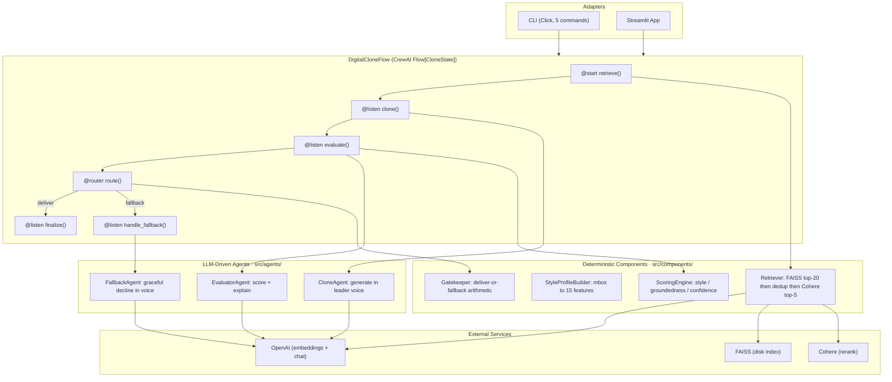

# P6: Torvalds Digital Clone

I built a multi-agent system that answers computer-science questions in the writing voice of Linus Torvalds or Greg Kroah-Hartman, with a deterministic gate that makes it decline rather than hallucinate when the corpus cannot support an answer. In-domain it delivers an in-voice answer 78.6% of the time as Torvalds and 81.0% as Kroah-Hartman across a three-pass run, both comfortably above the 55% ship target. On out-of-domain questions it stays silent 11 of 12 times. The twelfth is a gap I can show you the exact mechanism of, and it is the most interesting thing in this project.

Part of a 9-project AI engineering portfolio. 21 ADRs, 532 tests, 9 charts.


**Live Dashboard:** Deploying after all 9 projects complete. Link will be added here.



## Results

| Metric | Value | Bar | Status |
|--------|-------|-----|--------|
| In-domain deliver, Torvalds | 78.6% mean, range [71.4%, 85.7%] | E2 ≥ 55% | Pass |
| In-domain deliver, Kroah-Hartman | 81.0% mean, range [71.4%, 92.9%] | E2 ≥ 55% | Pass |
| Per-leader regression floor | T 42.9% / KH 35.7% | not below | Pass |
| OOD fallback | 91.7% (11/12) | 100% | Partial |
| Hallucinations on OOD | 0 | 0 | Pass |
| Groundedness gate | HHEM-2.1-Open entailment, threshold 0.40 | n/a | n/a |

Deliver rates are means over three passes at generation temperature 0.3, where a single pass is a noisy sample, so the operating point is a distribution and the range matters as much as the mean. Both leaders clear the 55% E2 target, the 39% E1 floor, and their honest per-leader floors (ADR-015). The full canonical run is [`results/evaluation.json`](results/evaluation.json).

E2, the ship target, is partially met. Two of its three criteria pass: the in-domain deliver rate clears 55% per leader, and zero hallucinations were produced on out-of-domain queries. The third, OOD fallback at 100%, misses by a single query (q20 as Torvalds). That query is not a hallucination, which is what makes it worth a section of its own below.

A note on numbers, because the ADRs and this README cite different ones. The deliver rates here come from a fresh three-pass run of the shipped system. The ADRs quote a frozen re-score (W3a: Torvalds 64.3%, Kroah-Hartman 78.6%) that ran the corrected metric over fixed, pre-generated responses to isolate the metric's effect alone. Those answer different questions, so the gap between them (Torvalds +14.3 points) is not a contradiction: part is temperature-0.3 generation noise, and part is the fixed system generating more groundable responses live than the frozen Day-12 responses W3a re-scored.

## How groundedness got measured, and why it had to change

The interesting engineering in this project is not the multi-agent plumbing. It is a measurement bug that nearly got read as a quality bug.

Through Day 12 the groundedness score was cosine similarity between the generated response and the retrieved chunks. Under that metric the Torvalds clone scored persistently below the Kroah-Hartman clone and below its floor on several in-domain queries. The obvious reading was a generation deficit, that the Torvalds clone was producing less grounded answers. Before excising anything from the Torvalds output, Day 13 asked the prior question, whether the deficit belonged to the clone or to the score.

It belonged to the score. Cosine similarity is symmetric and rewards shared vocabulary, but groundedness is a directional question about whether a claim is supported, and it should be indifferent to wording. Kroah-Hartman echoes the source vocabulary; Torvalds paraphrases supported claims in his own terse words. Cosine penalized the paraphrase. Three independent probes confirmed it (ADR-019): the score correlated with response length at r=0.39, it split containment-equal queries 7 of 7 toward Kroah-Hartman, and a blind containment instrument agreed with cosine on the Torvalds-versus-Kroah-Hartman direction on only 5 of 14 queries. The clone was fine. The metric was the defect.

The fix replaced cosine with HHEM-2.1-Open (ADR-020), a 110M-parameter local entailment model that scores per-sentence factual consistency with the chunk as premise and the generated sentence as hypothesis. It runs in-process in the ScoringEngine Component, so the deterministic router keeps a number it can trust without a network call or an LLM on the routing path. The cosine-era threshold of 0.60 does not transfer because entailment scores run lower than lexical-echo scores, so the threshold was re-derived to 0.40 by a safety-asymmetric rule: maximize grounded deliver rate while still catching at least 90% of content that should fall back. The model was chosen by a pre-registered bake-off against a hand-labeled containment oracle, and it won on every axis the other candidates split despite no candidate clearing all four gates outright.

The per-leader floors held under the corrected metric, which is the point of having locked them in advance. They were calibrated against the broken cosine score and could not be trusted until re-measured, and the re-measurement confirmed both leaders clear them. The floors were reframed from bias-compensation to what they honestly are, regression guardrails that confirm delivery has not dropped below the Day-8 baseline (ADR-015 W3c amendment).

<p align="center">
  
</p>

This distribution carries a finding I did not expect. HHEM is theoretically near-bimodal, polarizing toward 0 or 1 on clear entailment or contradiction pairs, and the working assumption was that in-domain scores would cluster near 0.9 with the 0.40 gate sitting in an empty valley. They do not. The scores form a continuous distribution peaking in the 0.40 to 0.60 band, where 51% of in-domain scores land, with the gate sitting at the low edge of that dominant cluster rather than below it. Fresh gpt-4o-mini generations against terse LKML prose produce intermediate scores, not polar verdicts. This is why the deliver rate is a distribution and not a fixed number: near-threshold decisions sit inside the busiest part of the score range, so pass-to-pass generation variance flips a handful of borderline queries on each run.

## Findings

The deliver rate spread per leader, per pass, against the acceptance criteria:

<p align="center">
  
</p>

Kroah-Hartman carries the wider spread (±10.9 points versus Torvalds' ±7.1), driven by a 92.9% third pass. Neither leader's worst pass falls below its floor, and neither leader's best pass is what gets reported as the headline. The mean is the operating point.

The grid below places every single-pass query-leader cell against the behavior the query set expects, deliver for in-domain and fallback for OOD. 32 of 40 cells match (21 of 28 in-domain delivered, 11 of 12 OOD fell back):

<p align="center">
  
</p>

The eight off-expectation cells are two different things. One is q20 as Torvalds, an out-of-domain query the gate delivered; it is the only off-expectation cell in the OOD block, and the section below is about it. The other seven are in-domain responses the gate declined because their groundedness landed below 0.40 (q01 KH, q05 both leaders, q07 both, q14 both). The grid marks those red, but they are the same conservative fallbacks the deliver-rate distribution already counts, the gate routing correctly on the score rather than the router making an error. q07 and q14 are the documented grounded-but-below-gate cases, where the paraphrase-sensitive metric sends a genuinely grounded answer to fallback (ADR-015).

The clones do match their leaders on measurable style. The 15-feature style profiles (punctuation frequency, vocabulary richness, capitalization ratio, plus LKML-specific markers) sit close to the source profiles for both leaders:

<p align="center">
  
</p>

### What the numbers mean

Style was never the hard part. The 15-feature extractor produces interpretable, per-dimension style scores that the CloneAgent matches well, and style is treated as quality metadata rather than a delivery veto (ADR-018). A slightly off-voice answer that is grounded and true is still worth delivering. The delivery decision rests on groundedness alone, because an ungrounded answer is a hallucination and that is the only failure the gate exists to stop.

The deliver rate being a band rather than a line is a property of the system, not a measurement flaw, for the reason the groundedness distribution shows above. Reporting a single pass would have hidden that jitter at the gate; the three-pass spread is the honest version.

## Architecture

The system is three LLM-driven Agents, four deterministic Components, and one Flow orchestrator (ADR-014). The split is enforced in code and CI: an Agent uses the CrewAI Agent abstraction with role, goal, and backstory and performs LLM reasoning, while a Component is a plain class with a `run()` method and no LLM call.

The Gatekeeper is a deterministic Component, not an Agent. It started as a GatekeeperAgent that used an LLM to make the routing call, and that was a mistake the rework corrected (ADR-018). An LLM placed at an arithmetic decision point fabricated nondeterminism: a record scoring 0.675 delivered while records at 0.727, 0.715, and 0.698 fell back, and the same query flipped deliver, fallback, deliver across three identical temperature-0 passes while its score barely moved. The arithmetically false reasoning strings it produced were the tell that it was not reading the number at all. The fix took the comparison away from the LLM and gave it to a pure function, and moved the human-facing explanation to the FallbackAgent, the one consumer that actually renders prose to a user.

| ADR | Decision | Why |
|-----|----------|-----|
| [ADR-009](docs/adr/ADR-009-agent-vs-component-distinction.md) / [ADR-014](docs/adr/ADR-014-agent-component-inventory.md) | Agent vs Component vocabulary lock; 3 Agents + 4 Components + 1 Flow | v1 called five things agents when only one used the LLM abstraction. The criterion is whether an LLM does the reasoning, enforced by CI grep. |
| [ADR-018](docs/adr/ADR-018-deterministic-routing.md) | Deterministic routing; Gatekeeper reclassified Agent to Component | An LLM at an arithmetic decision point produced non-monotonic, non-reproducible routing. A pure function cannot drift; the explanation moves to the FallbackAgent. |
| [ADR-019](docs/adr/ADR-019-groundedness-measures-lexical-echo.md) | Cosine groundedness measures lexical echo, not containment | The Torvalds deficit was the metric penalizing paraphrase, confirmed three ways. The clone was not changed. |
| [ADR-020](docs/adr/ADR-020-replace-cosine-with-local-entailment-scorer.md) | Replace cosine with HHEM-2.1-Open, threshold 0.40 | A local, in-process, deterministic entailment score keeps the router trustworthy. Threshold re-derived because entailment scores run lower than cosine. |
| [ADR-021](docs/adr/ADR-021-ship-known-biased-gate-compensate-at-floor.md) | Ship the gate with a known, measured paraphrase bias | The bias reproduced across three model families and is intrinsic to surface-sensitive metrics on terse prose. Documented openly, compensated at the floor. |
| [ADR-002](docs/adr/ADR-002-rag-config-embeddings-reranking-chunking.md) | OpenAI embeddings, Cohere rerank, dedup-before-rerank | 6 of 14 queries retrieved the same passage 2-3 times, cutting effective context. Dedup restores 5 distinct chunks before rerank. |
| [ADR-015](docs/adr/ADR-015-post-rework-eval-acceptance-criteria.md) | E1 floor and E2 target acceptance criteria, locked before measurement | Locking the bar in advance keeps the ship decision from being reasoned backward from whatever the numbers turn out to be. |

## Limitations

**q20 delivers an out-of-domain answer, and groundedness cannot catch it.** This is the OOD-fallback miss, and it is a characterized gap with a known fix, not a mystery. q20 is out of domain, but the Retriever still returns its top-5 chunks, and the Torvalds clone writes a response that those chunks happen to support well enough to score 0.422, above the 0.40 gate. The answer is genuinely grounded in the retrieved text. The problem is that the retrieved text is barely relevant to the question. Groundedness asks whether the answer is supported by the chunks, not whether the chunks are relevant to the query, so it passes q20 honestly.

The two signals separate cleanly. The chart below plots top-chunk retrieval relevance for in-domain versus out-of-domain queries on a log scale. q20's top chunk scores 0.0013 while every in-domain query's top chunk scores at least 0.32, a separation of about three orders of magnitude. Groundedness puts q20 inside the in-domain pack; retrieval relevance puts it far outside.

<p align="center">
  
</p>

The miss is systematic, not stochastic. q20 as Torvalds delivered on all three attempts (groundedness 0.422, 0.473, 0.403), and q20 as Kroah-Hartman sits right at the boundary too, holding at fallback on the first pass but flipping to deliver on one recheck. The fix is a query-relevance gate signal that floors top-chunk relevance alongside groundedness, and the evidence for it is the chart above. It is deferred rather than hidden, because adding a second gate signal touches the locked routing decision and belongs to a scoped change, not a wrap-up.

**A grounded Torvalds answer can still fall back on hard paraphrased queries.** The residual paraphrase bias that HHEM inherited from the metric family is real on hard queries even though it is zero on easy ones. A Torvalds response with genuine oracle grounding of 54% to 73% can score 0.28 to 0.38 on HHEM and route to fallback (q07 is the surviving in-sample example). This is the operational cost ADR-021 accepted when it chose a local deterministic gate over a paraphrase-robust LLM judge, and it is documented as a bounded limitation rather than tuned away, because lowering the Torvalds threshold to rescue these cases would weaken the same gate that defends against OOD hallucination.

**The corpus index carries baked-in duplication.** The persisted FAISS index holds 857 duplicate-content entries from build time. The Retriever deduplicates its candidate pool before reranking, which masks the problem for every live query, but the proper fix is a deduped index rebuild and re-embed (ADR-002 amendment). That is deferred and tracked as a cross-project data-quality issue.

## Tech Stack

| Component | Library | Why this one |
|-----------|---------|-------------|
| Orchestration | CrewAI Flow[CloneState] | Event-driven step order with typed Pydantic state carried across steps. The Flow is the orchestration; there is no planner agent. |
| Agents | CrewAI Agent + Task + Crew | Three LLM-driven agents, each a class wrapping one Agent, one Task, one single-agent Crew. |
| Structured output | Instructor + Pydantic v2 | Every agent output is a validated Pydantic model with auto-retry on validation failure. No raw `json.loads` on LLM output. |
| LLM routing | LiteLLM | Provider-agnostic. gpt-4o-mini for generation and the evaluator explanation. |
| Embeddings | OpenAI text-embedding-3-small (1536d) | Primary retrieval embedding, cached by MD5 to avoid re-calling on the same input. |
| Vector search | FAISS IndexFlatIP | Exact search over L2-normalized vectors, so dot product equals cosine. |
| Reranking | Cohere rerank-english-v3.0 | Two-stage retrieval: FAISS top-20, deduplicated before rerank (the W2 fix), then Cohere down to top-5. Graceful FAISS fallback if the API fails. |
| Groundedness | HHEM-2.1-Open (vendored) | Local 110M FLAN-T5 entailment model, in-process and deterministic. Vendored to two files to run on transformers 5.x and drop remote-code loading. |
| Style features | Custom 15-feature extractor | Interpretable per-dimension style over LKML mbox archives, not embedding-based, so each feature has human-readable meaning. |
| CLI | Click + Rich | Five commands: learn, index, query, compare, evaluate. |
| Demo | Streamlit | Interactive dual-leader querying. |
| Charts | Matplotlib | 9 Git-tracked PNGs generated from the canonical run. |
| Testing | pytest | 532 tests. LLM responses recorded and replayed, no live calls in CI. |

## Quick Start

```bash
uv sync && cp .env.example .env   # add OPENAI_API_KEY and COHERE_API_KEY
```

```bash
# Build a StyleProfile for a leader from an mbox archive
uv run cli learn --leader torvalds --mbox data/raw/lkml.mbox

# Build the FAISS index from the textbook corpus
uv run cli index

# Ask one leader a question
uv run cli query "How does kernel scheduling work?" --leader torvalds

# Ask both leaders side by side
uv run cli compare "How does kernel scheduling work?"

# Run the full evaluation set and write results
uv run cli evaluate --query-set data/eval/queries.json --output results/evaluation_dayN.json
```

```bash
uv run streamlit run streamlit_app.py   # localhost:8501
uv run pytest                            # 532 tests
```

Requires Python 3.12+, `uv`, an OpenAI API key, and a Cohere API key (free tier works; the Retriever falls back to FAISS top-5 without it).

---

Part of a [9-project AI engineering sprint](https://github.com/rubsj/ai-portfolio). Built Feb–June 2026.

Built by **Ruby Jha** · [LinkedIn](https://linkedin.com/in/jharuby) · [GitHub](https://github.com/rubsj/ai-portfolio)
</content>
