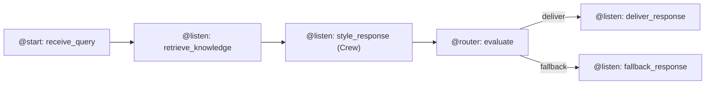

# ADR-001: CrewAI Flow over Sequential and Hierarchical Patterns

**Project:** P6: Torvalds Digital Clone
**Category:** Orchestration
**Status:** Accepted
**Date:** 2026-04-03

---

## Context

P6 needs an orchestrator that can do three things I couldn't work around:

1. After EvaluatorAgent scores a response, the system routes to one of two paths: deliver a styled response, or trigger fallback. There's no way to express "if score < 0.75, go here instead" without real branching.

2. Five agents share data: the query, retrieved chunks, the styled response, the evaluation scores. Without typed state management, you're threading dicts through function calls and losing the safety guarantees Pydantic gives you.

3. Running Torvalds and Kroah-Hartman on the same query means retrieve once (expensive), style twice (cheap). The orchestrator needs to support a "reuse chunks from the first run" pattern cleanly.

CrewAI offers three orchestration patterns. I had to pick one.

---

## Decision

CrewAI Flow (`DigitalCloneFlow(Flow[CloneState])`) with `@start`, `@listen`, and `@router` decorators. The Flow IS the PlannerAgent: it defines step order, state management, and conditional routing. A single-agent Crew handles only the ChatStyleAgent step, where LLM role/goal/backstory prompting adds real value. The other four "agents" (RAGAgent, EvaluatorAgent, FallbackAgent, and the PlannerAgent itself) are direct function calls within Flow steps.

`CloneState` is a Pydantic `BaseModel` that gets passed between all steps automatically. CrewAI populates it incrementally as each step completes, so there's no manual threading of state.

The `@router()` decorator makes branching explicit: the evaluation step returns either `"deliver"` or `"fallback"` as a string, and downstream `@listen("deliver")` and `@listen("fallback")` steps wire to those values. One wrong value (returning `True` instead of `"deliver"`, for example) and nothing routes. The pattern enforces correctness by failing loudly.

---

## Alternatives Considered

**Sequential Crew (process=Process.sequential)** - A list of Tasks runs in order, each Agent picking up context from the previous one. Can't branch. There's no way to say "skip the delivery step and run fallback instead" based on an intermediate result. I'd have to run both paths and pick one after the fact, which doubles latency.

**Hierarchical Crew (process=Process.hierarchical)** - A manager Agent decides at runtime which worker Agents to delegate to. On paper this looks like it handles branching, but in practice it doesn't. The manager calls LLM inference to pick which agent to call next, adding 1-2 seconds of latency with an LLM-as-router that can hallucinate wrong delegation. The Towards Data Science November 2025 analysis of CrewAI patterns documented production deployments where hierarchical Crews looped indefinitely instead of delegating. For a system where the routing condition is a deterministic number comparison (`score >= 0.75`), adding an LLM to make that decision is both slower and less reliable.

**Raw Python orchestration** - Skip CrewAI entirely and write a plain Python function that calls each step in sequence. Full control, no framework overhead. But I'd lose `@router` conditional branching (would have to implement it manually) and the typed `FlowState` passed between steps (would fall back to dicts or shared objects). The decorator-based routing and typed state justified the framework dependency.

---

## Quantified Validation

The Lead Score Flow example in the CrewAI docs uses `@router` to branch a high-score lead vs a low-score lead into different nurture paths. Same pattern as DigitalCloneFlow's deliver/fallback branch.

The DocuSign case study (CrewAI blog, December 2025) migrated from Sequential Crews to Flows specifically because Sequential couldn't express conditional logic with typed state. Same constraint I hit.

In my POC (`scratch/flow_poc.py`), I validated all four decorator patterns in isolation: `@start()`, `@listen(method_ref)`, `@listen("string")`, `@router()`. The router correctly routes to `"deliver"` when score >= 0.75 and to `"fallback"` when below. All state fields persist across steps via `PocState`. Runs cleanly with `uv run python scratch/flow_poc.py`.

---

## Consequences

The Flow architecture is lighter than expected. Since only ChatStyleAgent needs the LLM role/goal/backstory that CrewAI's `Agent` abstraction provides, the other four "agents" are just functions. I only have one `Crew` in the entire system. The CrewAI dependency is real but the coupling surface is small: if the Flows API changes, it's isolated to `src/flow.py` and `src/agents/style_crew.py`.

The risk is that CrewAI Flows is relatively new (introduced mid-2024). The API has changed between minor versions, which is why `pyproject.toml` pins `crewai>=0.108.0`. If a future version breaks `@router` semantics, I'd need to update `flow.py` but nothing else.

Dual-leader mode works cleanly: run `DigitalCloneFlow` once with `leader="torvalds"`, capture `state.retrieved_chunks`, then run again with `leader="kroah_hartman"` and inject the cached chunks. The `retrieve_knowledge` step checks `len(self.state.retrieved_chunks) > 0` and skips retrieval if chunks are already present. RAG retrieval (the expensive step) runs exactly once per query pair.
