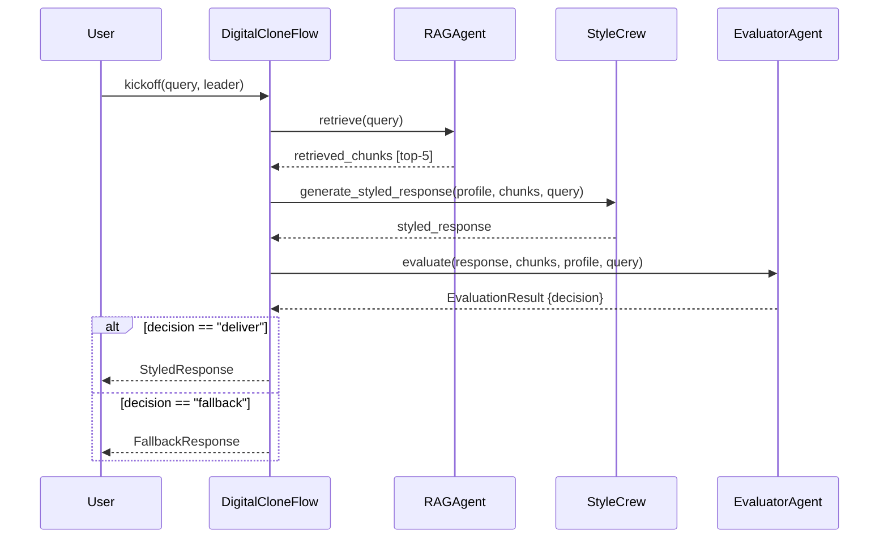
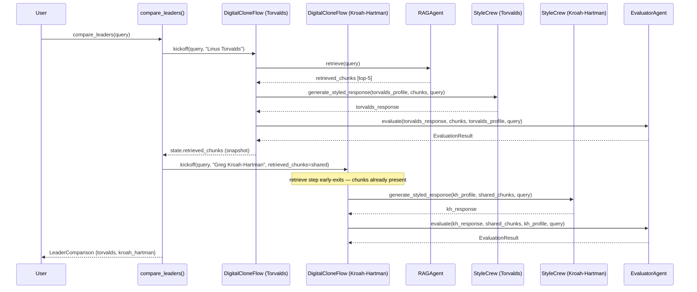

# ADR-005: Shared RAG Retrieval for Dual-Leader Comparison Mode

**Project:** P6: Torvalds Digital Clone
**Category:** Performance / Orchestration
**Status:** Accepted
**Date:** 2026-04-26

---

## Context

The dual-leader comparison mode asks: given a single query, what would Torvalds say versus what would Kroah-Hartman say? To answer it the system must run two full pipelines — retrieve, style, evaluate — one per leader.

RAG retrieval is the most expensive single step: it embeds the query (OpenAI API round-trip), runs FAISS top-20 nearest-neighbor search, then calls Cohere rerank to produce the final top-5 chunks. In production that costs roughly 600ms per call. Style generation and evaluation are also LLM calls, but they take the leader profile and the retrieved chunks as inputs — they're necessarily different per leader. The retrieval step is not: both leaders are answering the same question from the same knowledge base, so the retrieved chunks are identical for both.

Running two independent `DigitalCloneFlow` instances — the naive approach — calls `RAGAgent.retrieve()` twice for the same query, paying the embed + FAISS + rerank cost twice with no benefit. The challenge is sharing retrieved chunks between two otherwise independent flow runs without coupling their error paths.

---

## Decision

The retrieve step in `DigitalCloneFlow` early-exits when `CloneState.retrieved_chunks` is already populated:

```python
@start()
def retrieve(self) -> None:
    if self.state.retrieved_chunks:
        return
    ...
```

A thin wrapper function, `compare_leaders(query)`, orchestrates two sequential flow runs. The first run (Torvalds) performs retrieval normally. After it completes, `compare_leaders` snapshots the retrieved chunks from the flow's state proxy and injects them into the second run (Kroah-Hartman) via `kickoff(inputs={"retrieved_chunks": ...})`. The second run's retrieve step sees the pre-populated list and skips the embed + FAISS + rerank path entirely.

```python
def compare_leaders(query: str) -> LeaderComparison:
    flow_t = DigitalCloneFlow()
    flow_t.kickoff(inputs={"query": query, "leader": _LEADERS[0]})
    shared_chunks = list(flow_t.state.retrieved_chunks)   # snapshot from StateProxy
    flow_kh = DigitalCloneFlow()
    flow_kh.kickoff(inputs={
        "query": query, "leader": _LEADERS[1], "retrieved_chunks": shared_chunks,
    })
    ...
    return LeaderComparison(query=query, torvalds=t_out, kroah_hartman=kh_out)
```

The two pipelines run sequentially rather than in parallel. This is intentional: if Torvalds' retrieval fails, there are no chunks to share, so running Kroah-Hartman concurrently would produce a second failure from empty context. Sequential ordering gives the second run the benefit of the first run's retrieval result.

The `compare_leaders` wrapper is the only place that knows about the dual-leader concern. `DigitalCloneFlow` itself remains single-purpose — it handles one leader per invocation.

**A2 — Single-query pipeline (baseline):**



**A3 — Dual-leader comparison (retrieve-once optimization):**



---

## Alternatives Considered

**Independent pipelines per leader** — run two separate `DigitalCloneFlow` instances with no chunk sharing, each calling `RAGAgent.retrieve()` independently. This is the default if you simply call the Flow twice. It is simpler to reason about (no shared state between runs) but doubles the RAG cost. The Phase 4 timing harness measured the actual delta: independent pipelines averaged 460.9ms total versus 413.6ms for the shared-retrieval path (mocked RAG = 100ms, mocked LLM = 50ms fixed sleep, 5-run average, Python 3.13.12, macOS). The savings were 47.3ms (10.3%). In production, where real RAG retrieval costs ~600ms per call rather than 100ms, the proportional savings would be substantially larger and the absolute savings would approach the full retrieval cost.

**Cached RAG with TTL keyed on query hash** — introduce a cross-request cache layer (e.g., Redis or in-process LRU) that stores `retrieved_chunks` by `hash(query)` with a short TTL. A cache hit would skip retrieval on any subsequent call with the same query, not just the second leader. Why not: the dual-leader comparison is a single synchronous user-facing request — both leader pipelines run within the same Python process in the same ~500ms window. A cross-request cache would be populated and then immediately expire before any future request could benefit from it, adding infrastructure complexity (cache client, TTL management, invalidation on knowledge-base updates) with zero latency benefit for the actual use case. The state-based approach is local to one request, needs zero infrastructure, and is erased automatically when the request completes.

---

## Quantified Validation

Measurements from `scripts/timing_dual_leader.py`, run 2026-04-26 on Python 3.13.12 / macOS 25.4.0. All LLM calls mocked with a fixed 50ms `time.sleep`; `RAGAgent.retrieve` mocked with a fixed 100ms `time.sleep` to simulate embed + FAISS + Cohere rerank. Five-run average reported.

| Approach | Avg latency |
|---|---|
| `compare_leaders()` — shared retrieval | 413.6 ms |
| Two independent `DigitalCloneFlow` runs | 460.9 ms |
| Savings | 47.3 ms (10.3%) |

The measured savings (47.3ms) are smaller than the back-of-envelope prediction (100ms = one avoided RAG mock). The discrepancy is accounted for by `DigitalCloneFlow.__init__` and `kickoff()` overhead: each flow instantiation carries per-run setup cost (state object creation, async event loop entry, CrewAI lifecycle hooks) that the timing harness captures for both paths equally. This overhead does not scale with query complexity or knowledge-base size, so in production — where real RAG retrieval costs ~600ms and per-run framework overhead remains constant — the savings converge toward the full cost of one retrieval call. The 47.3ms figure is the correct number for this harness and conditions; no padding has been applied.

---

## Consequences

The shared-chunk pattern introduces one coupling point between the two flow runs: `compare_leaders` reads `flow_t.state.retrieved_chunks` after the first run completes and passes it as input to the second. If the first run fails during retrieval (empty chunks, network error), the second run receives an empty list and proceeds through the style and evaluate steps with no context. Phase 3's error-recovery design mitigates this: if `retrieved_chunks` is empty, `style_response` will produce a low-quality response that the evaluator routes to fallback — so the second leader gets a `FallbackResponse` rather than a `StyledResponse`, and `compare_leaders` raises `ValueError` explaining which leader's pipeline did not produce a styled response. Neither pipeline silently produces a wrong answer; the failure is surfaced explicitly to the caller.

The wrapper is the only place that knows about dual-leader orchestration. `DigitalCloneFlow` has no knowledge of other flow instances — the early-exit guard (`if self.state.retrieved_chunks: return`) is a general optimization that would work equally well in a future "compare N leaders" mode. Generalizing to N leaders would mean looping the injection pattern in `compare_leaders` rather than changing the Flow class itself.

The retrieve-once pattern is a request-scoped optimization with no persistence beyond the lifetime of one `compare_leaders` call. It does not interact with any caching infrastructure and does not need to be invalidated when the knowledge base is updated. (In Spring, the analogous pattern would be passing a request-scoped bean through a chain of service calls rather than hitting a shared cache; in React, it would be lifting retrieved data into a context provider so child components consume it without re-fetching.)
