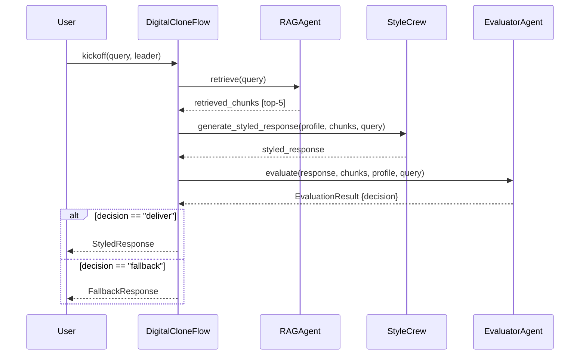
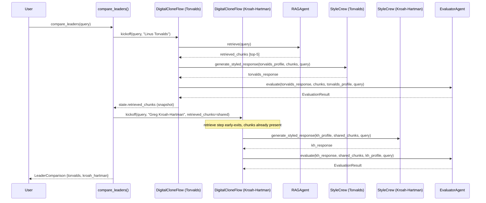

# ADR-005: Shared RAG Retrieval for Dual-Leader Comparison Mode

**Project:** P6: Torvalds Digital Clone
**Category:** Performance / Orchestration
**Status:** Accepted
**Date:** 2026-04-26

---

## Context

Comparison mode runs the full pipeline twice for one query: once styled as Torvalds, once as Kroah-Hartman. Each run does retrieve, then style, then evaluate.

The style and evaluate steps have to run per leader. They take the leader profile as input, so the outputs differ. Retrieval does not. Both leaders answer the same question against the same knowledge base, so the retrieved chunks are identical for both runs.

Retrieval is the most expensive step. It does an OpenAI embed + FAISS top-20 + Cohere rerank, and returns the top-5 chunks. The full round-trip costs roughly 600ms in production.

The naive implementation runs two independent `DigitalCloneFlow` instances back to back. Each one calls `RAGAgent.retrieve()` for itself, paying the embed + FAISS + rerank cost twice for chunks that are guaranteed to be identical. The fix needs to share retrieved chunks between the two runs without coupling their error paths or polluting `DigitalCloneFlow` with knowledge of the comparison use case.

---

## Decision

The retrieve step in `DigitalCloneFlow` early-exits when `CloneState.retrieved_chunks` is already populated:

```python
@start()
def retrieve(self) -> None:
    if self.state.retrieved_chunks:
        return
    ...
```

A thin wrapper, `compare_leaders(query)`, orchestrates two sequential flow runs. The first run (Torvalds) performs retrieval normally. After it completes, `compare_leaders` snapshots the retrieved chunks from the flow's state proxy and passes them as input to the second run (Kroah-Hartman) via `kickoff(inputs={"retrieved_chunks": ...})`. The second run's retrieve step sees the pre-populated list and skips the embed + FAISS + rerank path.

```python
def compare_leaders(query: str) -> LeaderComparison:
    flow_t = DigitalCloneFlow()
    flow_t.kickoff(inputs={"query": query, "leader": _LEADERS[0]})
    shared_chunks = list(flow_t.state.retrieved_chunks)   # snapshot from StateProxy
    flow_kh = DigitalCloneFlow()
    flow_kh.kickoff(inputs={
        "query": query, "leader": _LEADERS[1], "retrieved_chunks": shared_chunks,
    })
    ...
    return LeaderComparison(query=query, torvalds=t_out, kroah_hartman=kh_out)
```

The two runs are sequential. If Torvalds' retrieval fails there are no chunks to share, and running Kroah-Hartman concurrently would just produce a second failure from empty context.

**A2: Single-query pipeline (baseline)**



**A3: Dual-leader comparison (retrieve-once optimization)**



---

## Alternatives Considered

**Independent pipelines per leader.** Run two separate `DigitalCloneFlow` instances with no chunk sharing, each calling `RAGAgent.retrieve()` for itself. This is what you get if you call the Flow twice. Simpler in that there's no shared state between runs, but it doubles the cost of the most expensive step in the pipeline. The Phase 4 timing harness measured the difference; numbers are below.

**Cached RAG with TTL keyed on query hash.** Introduce a cross-request cache layer (Redis or in-process LRU) that stores `retrieved_chunks` by `hash(query)` with a short TTL. A cache hit would skip retrieval on any future call with the same query, not just the second leader of the current comparison. I rejected this because the dual-leader comparison is a single synchronous request. Both leader pipelines run within the same Python process in the same ~500ms window, so a cross-request cache would be populated and then expire before any future request could hit it. The cache adds a client, TTL handling, and an invalidation path tied to knowledge-base updates, none of which earn anything for the actual use case. State threading through the wrapper does the same job and disappears when the request completes.

---

## Quantified Validation

Measurements from `scripts/timing_dual_leader.py`, run 2026-04-26 on Python 3.13.12 / macOS 25.4.0. All LLM calls mocked with a fixed 50ms `time.sleep`; `RAGAgent.retrieve` mocked with a fixed 100ms `time.sleep` to simulate embed + FAISS + Cohere rerank. Five-run average reported.

| Approach | Avg latency |
|---|---|
| `compare_leaders()` (shared retrieval) | 413.6 ms |
| Two independent `DigitalCloneFlow` runs | 460.9 ms |
| Savings | 47.3 ms (10.3%) |

The savings are smaller than the back-of-envelope prediction of 100ms (one avoided RAG mock). The gap comes from `DigitalCloneFlow.__init__` and `kickoff()` overhead. Each flow instance pays a per-run setup cost: state object creation, async event loop entry, CrewAI lifecycle hooks. Both paths instantiate two flows, so both pay that cost twice and the harness sees it in both totals. That overhead is independent of query complexity or knowledge-base size, so in production with real retrieval costs the savings move toward the cost of one full retrieval call.

---

## Consequences

The shared-chunk pattern introduces one coupling point between the two runs: `compare_leaders` reads `flow_t.state.retrieved_chunks` after the first run completes and passes it into the second. If the first run fails during retrieval (empty chunks, network error), the second run starts with an empty list and proceeds through style and evaluate with no context. Phase 3's error-recovery design handles this. An empty `retrieved_chunks` produces a low-quality response that the evaluator routes to fallback, so the second leader returns a `FallbackResponse` rather than a `StyledResponse`. `compare_leaders` then raises `ValueError` naming which leader's pipeline did not produce a styled response.

`compare_leaders` is the only code that knows about dual-leader orchestration. `DigitalCloneFlow` has no awareness of other flow instances. The early-exit guard (`if self.state.retrieved_chunks: return`) is a general optimization, not a comparison-mode hook. A future "compare N leaders" mode would loop the injection pattern in the wrapper without changing the Flow class.

The retrieve-once pattern is request-scoped. It does not persist beyond one `compare_leaders` call, does not interact with any caching infrastructure, and does not need invalidation when the knowledge base changes. (In Spring the equivalent would be passing a request-scoped bean through a chain of service calls rather than going to a shared cache.)
