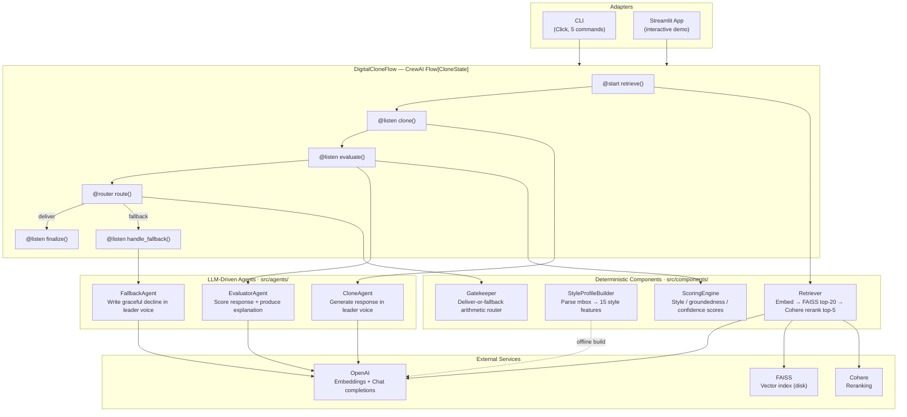

# A1 — System Architecture

> ADR-014 inventory: 3 Agents · 4 Components · 1 Flow. README hero diagram.

## Inventory (ADR-014, corrected 2026-06-01 per ADR-018)

| Kind | Count | Units |
|------|-------|-------|
| Agents (LLM-driven, `src/agents/`) | 3 | CloneAgent, EvaluatorAgent, FallbackAgent |
| Components (deterministic, `src/components/`) | 4 | Retriever, StyleProfileBuilder, ScoringEngine, Gatekeeper |
| Flow orchestrator | 1 | DigitalCloneFlow |

Gatekeeper is a deterministic Component (arithmetic router, no LLM) — reclassified from Agent per ADR-018.

> **PRD §7.5.3 prose contradiction (deferred reconciliation):** The PRD §7.5.3 A1 description reflects the pre-ADR-018 inventory (4 Agents + 3 Components, with Gatekeeper classified as an Agent). This diagram follows ADR-014 (the locked decision — 3 Agents + 4 Components); the PRD prose update is deferred to the full PRD reconciliation pass.
