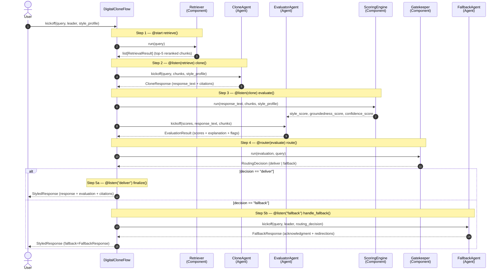

# A2 — Single-Query Sequence

> ADR-014 inventory: 3 Agents · 4 Components · 1 Flow. Single call to `DigitalCloneFlow.kickoff()`.

## Notes

- **Gatekeeper is deterministic** — arithmetic threshold comparison, no LLM (ADR-018). It reads `GROUNDEDNESS_MIN = 0.40` from EvaluatorAgent's constants and routes based on scores and flags.
- **ScoringEngine** is called inside the evaluate step before EvaluatorAgent; it provides the three numerical scores. EvaluatorAgent adds the LLM-generated explanation and flags.
- **FallbackAgent** carries a hardcoded template failsafe: if its LLM call fails, a short unstyled response returns so the user always gets a reply.
- **CloneState** is the typed Pydantic state object passed between all steps — each step reads prior outputs from state and writes its result back.

> **PRD §7.5.3 prose contradiction (deferred reconciliation):** The PRD §7.5.3 A2 description reflects the pre-ADR-018 routing step (Gatekeeper as an LLM Agent). This diagram follows ADR-014/ADR-018 — Gatekeeper is a deterministic Component.
