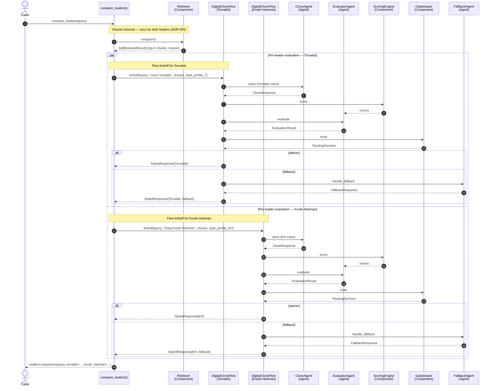

# A3 — Dual-Leader Sequence

> ADR-014 inventory: 3 Agents · 4 Components · 1 Flow. `compare_leaders()` pattern — retrieve once, evaluate per-leader (ADR-005).

## Notes

- **Retrieve-once optimization (ADR-005):** The top-5 reranked chunks are fetched once and shared between both leader flows. This halves the OpenAI embedding call + FAISS search + Cohere rerank cost for a dual-leader query.
- **Two independent Flow instances** run after the shared retrieval — each carries a per-leader `StyleProfile` from disk cache. The flows do not share state.
- **Gatekeeper** applies the same arithmetic thresholds for both leaders independently — the deliver/fallback decision is per-response, not per-leader.
- The `LeaderComparison` output carries either `StyledResponse` or `FallbackResponse` for each leader position, so the caller always gets both slots filled.

> **PRD §7.5.3 prose contradiction (deferred reconciliation):** The PRD §7.5.3 A3 description reflects the pre-ADR-018 per-leader path (Gatekeeper as an LLM Agent). This diagram follows ADR-014/ADR-018 — Gatekeeper is a deterministic Component.
