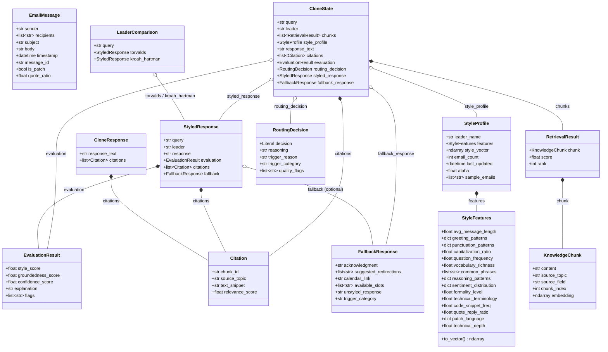

# A4 — Data Models

> Pydantic models from `src/schemas.py`. Arrows show composition / ownership.

## Notes

- **CloneState** is the typed Pydantic `Flow[CloneState]` state: all fields have defaults; the flow populates them incrementally as each step completes.
- **EvaluationResult** has no `final_score` field — routing is done by Gatekeeper's arithmetic, not a weighted formula (ADR-018). `extra="forbid"` enforces this.
- **StyleFeatures** holds 15 normalized [0, 1] features: 11 base + 4 LKML-specific. `to_vector()` concatenates them to a length-15 `ndarray` for cosine comparison.
- **FallbackResponse** carries `unstyled_response` — the hardcoded failsafe string FallbackAgent writes if its LLM call fails.
