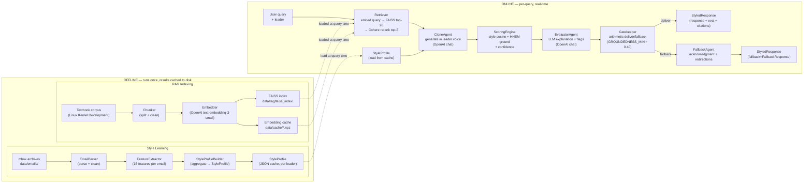

# A5 — Data Flow

> Two swim lanes: Offline (run once, cached to disk) and Online (per-query pipeline).

## Notes

- **Offline lane runs once per corpus / leader** — output is disk-cached. No offline step runs at query time.
- **StyleProfileBuilder** (offline only) is not called during a query — `StyleProfile` is loaded from the JSON cache. The distinction matters: StyleProfileBuilder is a Component, but it does not appear in the online path.
- **HHEM groundedness** in ScoringEngine uses the vendored HHEM-2.1-Open model (ADR-020) loaded from `data/models/` — not an API call. The model is loaded at process start, not per-query.
- **Gatekeeper** threshold: `GROUNDEDNESS_MIN = 0.40` (HHEM scale). The threshold and floors are locked (ADR-015, ADR-020, ADR-018).
- **Retriever** loads FAISS index from disk on each flow start. The `*.npz` embedding cache accelerates re-indexing; the live query path uses only the FAISS index.
