# A6 — Agent vs Component

> Visual of the ADR-009 / ADR-014 distinction: LLM-driven Agents (left) vs deterministic Components (right). ADR-018 reclassified Gatekeeper from Agent to Component.

```mermaid
graph TB
    subgraph CRITERION["ADR-009 Classification Criterion"]
        direction LR
        LLM_def["Agent — LLM-driven reasoning\nCrewAI Agent with role, goal, backstory\nOutput depends on model temperature"]
        DET_def["Component — deterministic Python\nclass with run() method\nSame input → same output, always"]
    end

    subgraph AGENTS["LLM-Driven Agents  ·  src/agents/  ·  count: 3"]
        CA["CloneAgent\n─────────────────────────\nRole: Linux kernel expert\n(Torvalds or KH voice)\nInput: query + chunks + StyleProfile\nOutput: CloneResponse\n(response_text + citations)"]

        EA["EvaluatorAgent\n─────────────────────────\nRole: response quality evaluator\nHybrid: ScoringEngine for numbers,\nLLM for explanation + flags (ADR-011)\nOutput: EvaluationResult"]

        FA["FallbackAgent\n─────────────────────────\nRole: graceful decline writer\nInput: query + leader + RoutingDecision\nOutput: FallbackResponse\n(+ hardcoded failsafe template)"]
    end

    subgraph COMPONENTS["Deterministic Components  ·  src/components/  ·  count: 4"]
        RT["Retriever\n─────────────────────────\nEmbed query (OpenAI)\nFAISS top-20 search\nCohere rerank → top-5\nOutput: list[RetrievalResult]"]

        SPB["StyleProfileBuilder\n─────────────────────────\nParse mbox → EmailMessage\nExtract 15 StyleFeatures per email\nAggregate → StyleProfile\n(offline only — cached to disk)"]

        SE["ScoringEngine\n─────────────────────────\nStyle score: cosine(response, StyleProfile)\nGroundedness: HHEM-2.1-Open entailment\nConfidence: Cohere relevance\nOutput: 3 float scores (no LLM)"]

        GK["Gatekeeper\n─────────────────────────\nArithmetic threshold comparison\nGROUNDEDNESS_MIN = 0.40 (HHEM scale)\nDecision: deliver | fallback\nNo LLM — reclassified per ADR-018"]
    end

    CRITERION -.-> AGENTS
    CRITERION -.-> COMPONENTS

    LLM_def -.->|"classifies"| CA
    LLM_def -.->|"classifies"| EA
    LLM_def -.->|"classifies"| FA
    DET_def -.->|"classifies"| RT
    DET_def -.->|"classifies"| SPB
    DET_def -.->|"classifies"| SE
    DET_def -.->|"classifies"| GK
```

## Inventory summary (ADR-014, corrected 2026-06-01 per ADR-018)

| Unit | Kind | Criterion met | src/ path |
|------|------|---------------|-----------|
| CloneAgent | Agent | LLM reasoning (response generation) | `src/agents/clone_agent.py` |
| EvaluatorAgent | Agent | LLM reasoning (explanation + flags) | `src/agents/evaluator_agent.py` |
| FallbackAgent | Agent | LLM reasoning (decline writing) | `src/agents/fallback_agent.py` |
| Retriever | Component | Deterministic `run()` — embed + FAISS + Cohere | `src/components/retriever.py` |
| StyleProfileBuilder | Component | Deterministic `run()` — parse + extract features | `src/components/style_profile_builder.py` |
| ScoringEngine | Component | Deterministic `run()` — cosine + HHEM + Cohere | `src/components/scoring_engine.py` |
| Gatekeeper | Component | Deterministic `run()` — arithmetic threshold | `src/components/gatekeeper.py` |

**Gatekeeper is a Component, not an Agent.** Reclassified per ADR-018 — it performs arithmetic threshold comparison, not LLM reasoning. DigitalCloneFlow is plain CrewAI `Flow[CloneState]` orchestration — not an Agent, and carries no per-step LLM reasoner on top of it. The v1 misclassifications are recorded in ADR-001 and ADR-014; this diagram is the corrected v2 picture.

> **PRD §7.5.3 prose contradiction (deferred reconciliation):** The PRD §7.5.3 A6 description shows "4 Agents + 3 Components." This diagram follows ADR-014/ADR-018 (3 Agents + 4 Components).
