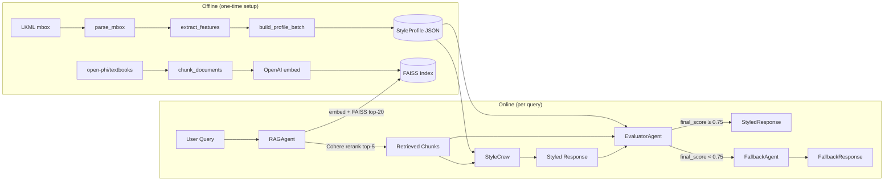

# A5 — Data Flow

```mermaid
graph LR
    subgraph Offline["Offline (one-time setup)"]
        MBOX[LKML mbox] --> PARSER[parse_mbox]
        PARSER --> FEAT[extract_features]
        FEAT --> PROF[build_profile_batch]
        PROF --> PROFILE[(StyleProfile JSON)]

        CORPUS[open-phi/textbooks] --> CHUNKER[chunk_documents]
        CHUNKER --> EMBEDDER[OpenAI embed]
        EMBEDDER --> IDX[(FAISS Index)]
    end

    subgraph Online["Online (per query)"]
        QUERY[User Query] --> RAG[RAGAgent]
        RAG -->|embed + FAISS top-20| IDX
        RAG -->|Cohere rerank top-5| CHUNKS[Retrieved Chunks]

        CHUNKS --> STYLE[StyleCrew]
        PROFILE --> STYLE
        STYLE --> RESP[Styled Response]

        RESP --> EVAL[EvaluatorAgent]
        CHUNKS --> EVAL
        PROFILE --> EVAL

        EVAL -->|final_score ≥ 0.75| DELIVER[StyledResponse]
        EVAL -->|final_score < 0.75| FALLBACK[FallbackAgent]
        FALLBACK --> FBOUT[FallbackResponse]
    end
```
