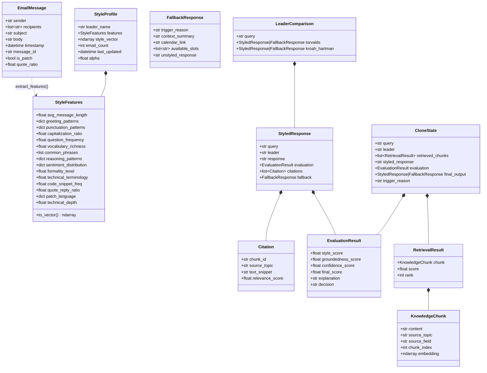

# A4 — Data Models

All 11 Pydantic v2 models from `src/schemas.py`.

```mermaid
classDiagram
    class EmailMessage {
        +str sender
        +list~str~ recipients
        +str subject
        +str body
        +datetime timestamp
        +str message_id
        +bool is_patch
        +float quote_ratio
    }

    class StyleFeatures {
        +float avg_message_length
        +dict greeting_patterns
        +dict punctuation_patterns
        +float capitalization_ratio
        +float question_frequency
        +float vocabulary_richness
        +list common_phrases
        +dict reasoning_patterns
        +dict sentiment_distribution
        +float formality_level
        +float technical_terminology
        +float code_snippet_freq
        +float quote_reply_ratio
        +dict patch_language
        +float technical_depth
        +to_vector() ndarray
    }

    class StyleProfile {
        +str leader_name
        +StyleFeatures features
        +ndarray style_vector
        +int email_count
        +datetime last_updated
        +float alpha
    }

    class KnowledgeChunk {
        +str content
        +str source_topic
        +str source_field
        +int chunk_index
        +ndarray embedding
    }

    class RetrievalResult {
        +KnowledgeChunk chunk
        +float score
        +int rank
    }

    class Citation {
        +str chunk_id
        +str source_topic
        +str text_snippet
        +float relevance_score
    }

    class EvaluationResult {
        +float style_score
        +float groundedness_score
        +float confidence_score
        +float final_score
        +str explanation
        +str decision
    }

    class FallbackResponse {
        +str trigger_reason
        +str context_summary
        +str calendar_link
        +list~str~ available_slots
        +str unstyled_response
    }

    class StyledResponse {
        +str query
        +str leader
        +str response
        +EvaluationResult evaluation
        +list~Citation~ citations
        +FallbackResponse fallback
    }

    class LeaderComparison {
        +str query
        +StyledResponse|FallbackResponse torvalds
        +StyledResponse|FallbackResponse kroah_hartman
    }

    class CloneState {
        +str query
        +str leader
        +list~RetrievalResult~ retrieved_chunks
        +str styled_response
        +EvaluationResult evaluation
        +StyledResponse|FallbackResponse final_output
        +str trigger_reason
    }

    StyleProfile *-- StyleFeatures
    EmailMessage ..> StyleFeatures : extract_features()
    RetrievalResult *-- KnowledgeChunk
    StyledResponse *-- EvaluationResult
    StyledResponse *-- Citation
    LeaderComparison *-- StyledResponse
    CloneState *-- RetrievalResult
    CloneState *-- EvaluationResult
```
