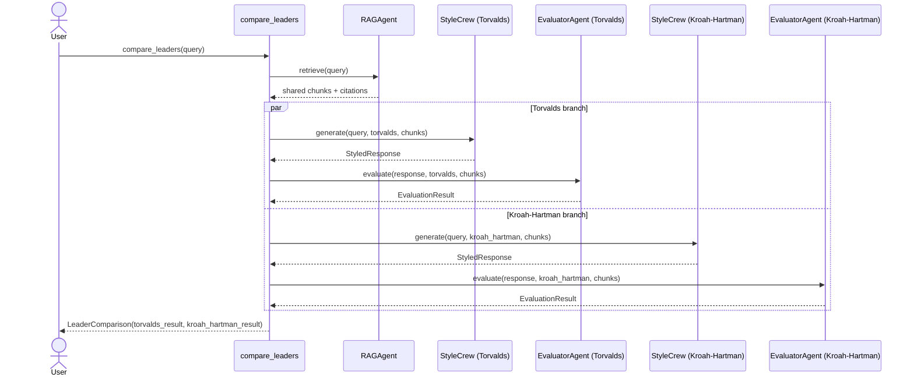

# A3 — Dual-Leader Sequence

Runtime path for `compare_leaders(query)`. RAG retrieval runs once; the
shared chunk set is reused for both style+evaluate branches. This avoids
a second embedding + rerank round-trip for the same query text.

