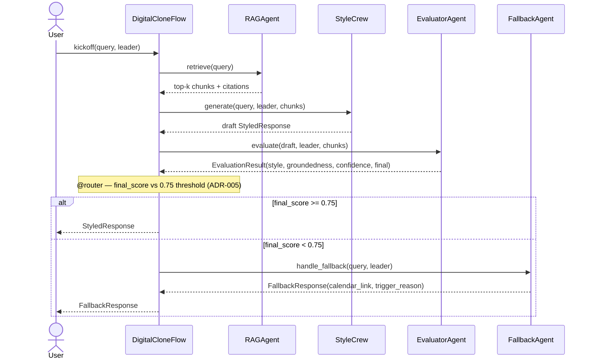

# A2 — Single-Query Sequence

Runtime path for one query against one leader.
The delivery threshold (0.75) is an Architecture Rule locked in ADR-005.

```mermaid
sequenceDiagram
    actor User
    participant DCF as DigitalCloneFlow
    participant RA as RAGAgent
    participant SC as StyleCrew
    participant EA as EvaluatorAgent
    participant FA as FallbackAgent

    User->>DCF: kickoff(query, leader)
    DCF->>RA: retrieve(query)
    RA-->>DCF: top-k chunks + citations

    DCF->>SC: generate(query, leader, chunks)
    SC-->>DCF: draft StyledResponse

    DCF->>EA: evaluate(draft, leader, chunks)
    EA-->>DCF: EvaluationResult(style, groundedness, confidence, final)

    Note over DCF: @router — final_score vs 0.75 threshold (ADR-005)

    alt final_score >= 0.75
        DCF-->>User: StyledResponse
    else final_score < 0.75
        DCF->>FA: handle_fallback(query, leader)
        FA-->>DCF: FallbackResponse(calendar_link, trigger_reason)
        DCF-->>User: FallbackResponse
    end
```
