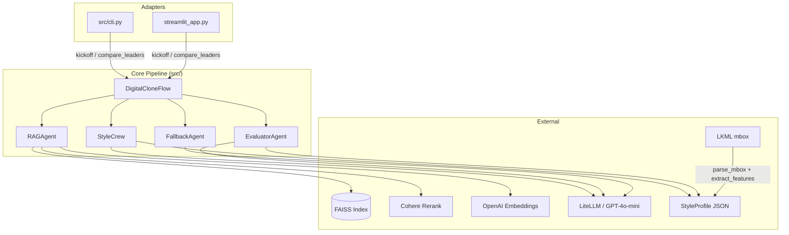

# A1 — System Architecture

```mermaid
graph TB
    subgraph Adapters
        CLI[src/cli.py]
        UI[streamlit_app.py]
    end

    subgraph Core["Core Pipeline (src/)"]
        DCF[DigitalCloneFlow]
        RA[RAGAgent]
        SC[StyleCrew]
        EA[EvaluatorAgent]
        FA[FallbackAgent]
    end

    subgraph External
        FAISS[(FAISS Index)]
        COHERE[Cohere Rerank]
        OAI_EMB[OpenAI Embeddings]
        LLM[LiteLLM / GPT-4o-mini]
        MBOX[LKML mbox]
        PROFILE[StyleProfile JSON]
    end

    CLI -->|kickoff / compare_leaders| DCF
    UI  -->|kickoff / compare_leaders| DCF

    DCF --> RA
    DCF --> SC
    DCF --> EA
    DCF --> FA

    RA --> OAI_EMB
    RA --> FAISS
    RA --> COHERE

    SC --> PROFILE
    SC --> LLM

    EA --> LLM
    EA --> PROFILE

    FA --> LLM

    MBOX -->|parse_mbox + extract_features| PROFILE
```
